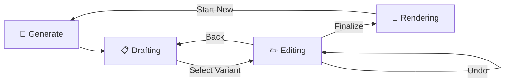

# Skaitch: A Two-Stage Generative Framework for High-Fidelity Forensic Composite Portraits

**Skaitch** is a specialized, GPU-accelerated forensic application engineered to produce professional-grade composite portraits from structured categorical inputs. By bridging expert morphological descriptors with a dual-phase generative pipeline, Skaitch transforms verbal descriptions into high-fidelity visual evidence.

Phase I translates semantic descriptors into hyper-detailed pencil sketches via **Stable Diffusion XL (SDXL)**, immediately refined by **CodeFormer** face restoration. Phase II leverages the synthesized sketch as a geometric anchor for an **SDXL-ControlNet** refinement pass, achieving a photorealistic "photographic" translation.


---

## 1. System Architecture Overview

Skaitch is a unified PyTorch-based framework designed for high-fidelity portrait synthesis on memory-constrained hardware (e.g., NVIDIA T4).

### Infrastructure Requirements
* **Compute:** NVIDIA T4 GPU (15GB VRAM), utilizing **Model CPU Offloading** via `accelerate`.
* **Storage:** Fast NVMe SSDs (`/opt/dlami/nvme/models/`) for caching SDXL and ControlNet weights.
* **Environment:** Python 3.12+ (Linux recommended). No JIT or C++ compilation required.

---

## 2. Phase I: Sketch Synthesis (SDXL + CodeFormer)

Phase I translates semantic morphological descriptors into a high-detail pencil sketch.

* **VRAM Optimization:** The pipeline uses `enable_model_cpu_offload()` to manage weight residency, enabling SDXL inference on a single T4. Computations are executed in `torch.float16` at $1024 \times 1024$ resolution.
* **Stochastic Variation:** Skaitch generates **3 parallel variants** per run, providing investigators with alternative interpretations of the same description.
* **Face Restoration:** Raw sketches are processed by **CodeFormer**, which sharpens facial geometry and restores structural integrity to translated descriptors.

---

## 3. Phase II: Photorealistic Refinement (SDXL-ControlNet)

The refinement phase transforms the forensic sketch into a photographic-quality evidence portrait.

* **Dynamic Feature Synchronization:** Feature selections (Ethnicity, Eye Color, Hair, Spectacles, etc.) are propagated from Phase I to Phase II. This ensures the photorealistic result honors the specific traits selected by the investigator.
* **Morphological Guidance:** Uses **SDXL-ControlNet (Canny)** with an optimized **0.65 conditioning scale** to anchor the photographic synthesis to the sketch's geometry while allowing prompt-driven chromatic accuracy.
* **Refinement Precision:** Implements **Weighted Prompting** (1.6x for eye color, 1.3x for hair/spectacles) to prevent the source sketch from overriding color and accessory instructions.
* **Comprehensive Morphology:** Supports a global ethnicity library (East Asian, South Asian, etc.) and specialized accessories like frame-shaped spectacles with adjustable tints.

---

## 4. Technical Evolution: From GANs to Diffusion

Skaitch has been re-engineered to move past legacy limitations.

### 4.1 Legacy: The DFD/Jittor Era
Originally, Phase II used **DeepFaceDrawing (DFD)** on the Jittor framework.
- **Issues:** Rigid 512x512 resolution, extreme dependency friction (JVC/GCC-13), and limited realism.

### 4.2 Modern: SDXL-ControlNet (V1 to V2)
The architecture was rebuilt on a modern, stable Diffusers stack.
- **Superior Quality:** Native 1024px resolution and cinematic skin synthesis.
- **Precision:** Dynamic prompt synchronization ensures the "Photographic" pass matches the "Sketch" pass exactly.

### 4.3 V2.1: Overcoming Diffusion Limitations
During rigorous testing, two fundamental limitations of diffusion models in a forensic context were identified and resolved:
- **Attention Bleed (Hallucinations):** SDXL's CLIP encoders struggle with long lists of comma-separated traits (e.g., "blue eyes, oval face, narrow nose..."), often hallucinating missing features or applying colors to the wrong body part. **Solution:** Implemented **Narrative Prompting**—dynamically generating coherent, grammatically correct English sentences from categorical inputs to enforce strict trait adherence.
- **Inflexible Geometry (Global i2i):** Making a structural geometric edit (e.g., widening a jaw) requires high-denoise strength, which destroys the rest of the face's identity in a standard Image-to-Image pipeline. **Solution:** Implemented **Regional Inpainting**. Operators now physically mask the target trait, allowing the system to blast 85% noise strictly into the masked region while keeping 95% of the face mathematically frozen, exactly mirroring professional forensic reconstruction standards.

---

## 5. Deployment & Setup

### I. Installation
```bash
git clone https://github.com/ShishirModi/Skaitch.git
cd Skaitch
pip install -r requirements.txt
```

### II. Automated Weights Initialization
Skaitch automatically manages all model weights. By default, they are downloaded to a local `./models/` directory inside the repository, but this can be customized securely on any platform via the `.env` file (`SKAITCH_MODEL_DIR`). Simply run:
```bash
streamlit run app.py
```

**Automated Setup Includes:**
- **SDXL Base:** `$SKAITCH_MODEL_DIR/sdxl/`
- **ControlNet Canny:** `$SKAITCH_MODEL_DIR/controlnet-canny-sdxl/`
- **CodeFormer:** `$SKAITCH_MODEL_DIR/codeformer/` (Weights) and `external/CodeFormer/` (Repo)

---

## 6. User Interface & V2 Iterative Workflow

Skaitch features a **Professional SaaS Dashboard** aesthetic utilizing a deep Slate & Forensic Cyan theme for clinical precision.

- **Main Canvas Feature Cards:** Primary morphological traits (Face, Eyes, Nose, Hair, Marks) are structured into categorical dashboard widget cards.
- **Instrument Panel Sidebar:** GPU telemetry, parameters, and dimension controls are isolated in a clean control sidebar.
- **Precision Visual Aids:** Custom two-tone SVG diagrams anchor trait selections with professional clarity.
- **Draft → Select → Edit → Render:** The operator generates 3 sketch variants (displayed as vertical stacked cards), selects the best one, iteratively edits it via interactive mask painting and natural-language instructions (SDXL Inpainting), and triggers the photorealistic ControlNet pass when satisfied.
- **Edit Controls:** A proprietary, locally-hosted React Streamlit Component (`skaitch_canvas`) manages interactive masking. This guarantees 100% stability against Streamlit frontend changes, flawlessly handling base64 background rendering and dynamic brush scaling. Full undo history is maintained for non-destructive editing.
- **Auto-Persistent Storage:** Finalized sketches and refinements are saved to `data/` with unique timestamps.

### V2 Workflow Architecture


